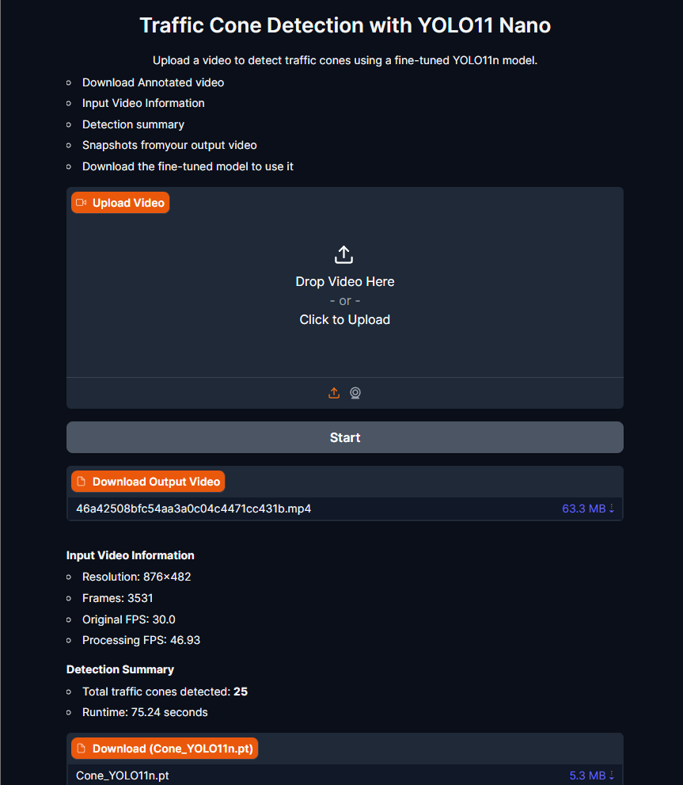
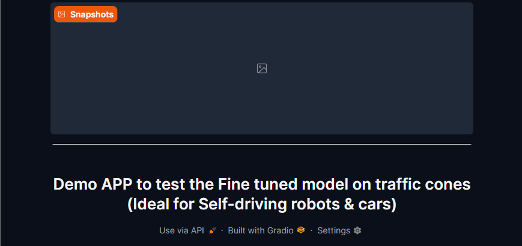
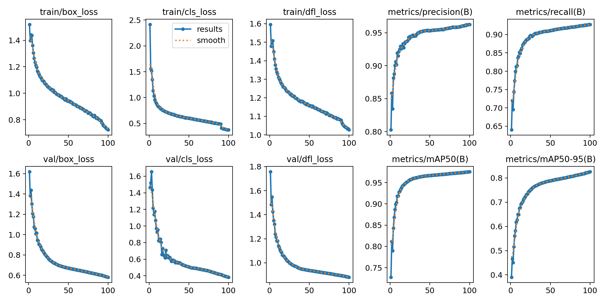

## Cone-YOLO: Traffic Cone Detection
 Gradio app powered by a fine-tuned YOLOv11 Nano  model trained to detect traffic cones. It's optimized for autonomous robots and cars.

---

## Features

-  Download Annotated video
-  Input Video Information  
-  Detection summary  
-  Snapshots from your output video  
-  Download the fine-tuned model to use it in your project
---

           

---

## 🚀 Fine-tuned Model

- Base Model: YOLOv11(Nano version)               (https://github.com/ultralytics/ultralytics).
  Thanks to Ultralytics for providing the YOLO family of models that made this project possible.
- Training Dataset: traffic cone  annotated in YOLO11 format.
- Input Size: 640x640
- Training Configuration (Epochs: 100, Batch Size: 16 )

##  Training Results

---

 ##   Live Demo with (Hugging Face Space)
 
 🔗[Try Cone-YOLO](https://huggingface.co/spaces/Hamadeen99/Cone-YOLO)
 - Tip: Try a small video, no more than 5 seconds. 

